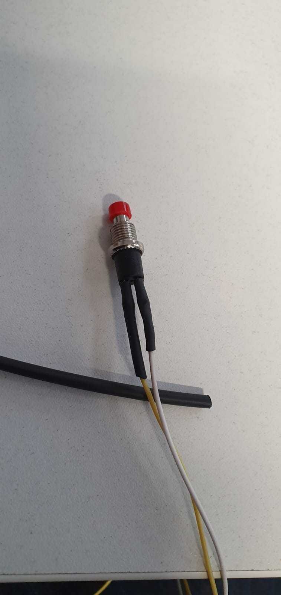
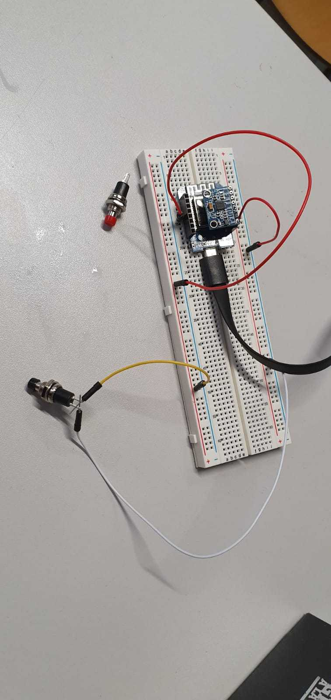
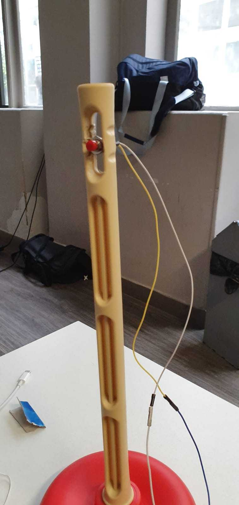
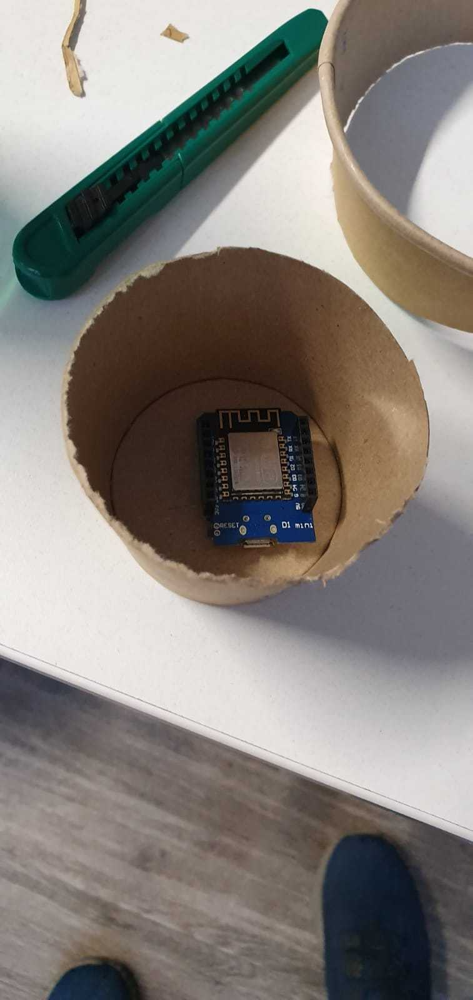

# Asteroid

## Project


Our project consist in a wifi controller for the famous game Asteroid !

The game is about surviving among asteroids destroying the most we can.

In this Game, the user's actions are :

* Go forward
* Rotate on the left
* Rotate on the right
* Fire some lasers

We thought that was all kind of actions we could match with an accelerometer.


That is why we decided to create our own controller !


## The controller

### Components

* Accelerometer : GY-521
* Wifi module : ESP8266 WeMos D1 mini
* Push button

### Role

The main role of our controller is to be able, with it's accelerometer, to detect the X ans Z angles in order to hanfdle going forward and rotating.

We also added a Push Button in order to handle the differents clicks in the Game and to fire lasers.

### Controller historic

At first, we had to weld the push button with wire



Then we experimented the button by just linking it to the wemos.



After that, we decided to use a suction cup in order to be able to play with the accelerometer like if it was a joystick.

So we had to find a way to put the button on it.



Finally, We had to put the wemos in a certain position in order to be sure that the accelerometerr would send the right informations to the game.

So we had to think about a way to fix the wemos to the suction cup.

We went for a gobelet and.... TADA !




### Controller Code

The controller code is not really difficult.
We used the accelerometer methods in order to get the X and Z axis that interested us.

```
mpu6050.getAccX()
mpu6050.getAccZ()
```

In order to be able to communicate these positions to others (our Game), we connected the wemos to the Wifi.

Then, we just had to send OSC messages to the game like this :

```
msg.add(mpu6050.getAccX());
msg.add(mpu6050.getAccZ());
msg.add(pressed);               // Pressed being the button state
Udp.beginPacket(outIp, outPort);
msg.send(Udp);
Udp.endPacket();
msg.empty();
```

## The Processing Game

### Why Processing

Processing is a really simple and usefull way to create animations and graphics in Java.

Also, there are a lot of open-source projects : https://www.openprocessing.org

We decided to start from an existing game that we found on https://www.openprocessing.org/sketch/106239/

### What we modified

Beside some basic changes like speed, adding a score / high score logic etc.. we had to implements 2 things.

* A OSC interpretor in order to listen to the Controller's messages
* A mapping between Controller messages and Game logic

#### The interpretor

Listening for OSC messages is not complicated in Processing.
We implemented it this way :

``` 
OscP5 osc;
ControlP5 cp;

// During Setup
osc = new OscP5(this, 4559);
cp = new ControlP5(this);
```

"this" enable you implement a callback on each message received on the specified port

``` 
void oscEvent(OscMessage m) {}
```

We then just had to get the values from these messages

``` 
float rotation = m.get(0).floatValue();
```

#### The Mapping

We tried, with our mapping, to retro-engineer the existing game's algorithm and to not change it too much.

The algorithm had already a callBack when a click occured on screen :

``` 
void mousePressed()
```

This callback was not the one that triggered lasers but we had it to it's functionnality in order to enable us to have only one function handling every click of our Push Button.

``` 
// In the OSC messages callback 
float buttonPressed = m.get(2).floatValue();
  
if(buttonPressed == 1) {
mousePressed(); 
}
```

We did the same logic of using the pre-existing algorithm in order to handle movements.


