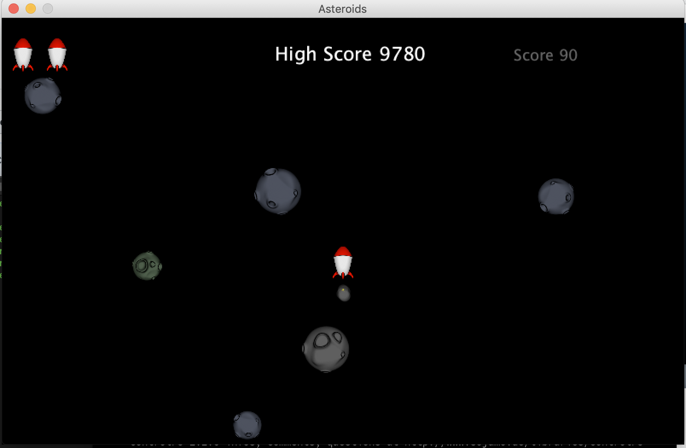

# Asteroid

## Project

Our project consist in a wifi controller for the famous game Asteroid !

The game is about surviving among asteroids destroying the most we can.

In this Game, the user's actions are :

* Go forward
* Rotate on left
* Rotate on right
* Fire some lasers

We thought that was all kind of actions we could match with an accelerometer.

That is why we decided to create our own controller !
## 
